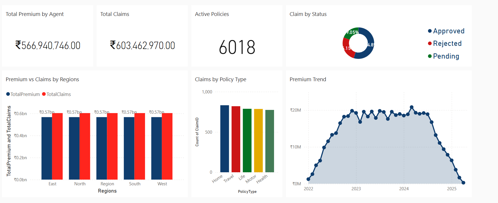

# Insurance Analytics Dashboard (Power BI)

## Project Overview
This project presents an interactive Power BI dashboard built to analyze insurance policy and claims data.  
The dashboard helps identify key business insights related to premiums, claims, policy distribution, and claim ratios.

The goal of this project is to transform raw insurance data into meaningful visual insights that can help stakeholders make data-driven decisions.

---

## Tools & Technologies Used

Power BI  
DAX (Data Analysis Expressions)  
Microsoft Excel  
Data Modeling  
Data Visualization

---

## Key Features of the Dashboard

• Total Premium Analysis  
• Claims Amount Tracking  
• Claim Ratio Calculation  
• Policy Distribution Analysis  
• Interactive Filters and Slicers  
• Regional and Category-wise Insights  

---

## Key Metrics

The dashboard includes calculated metrics such as:

• Total Premiums  
• Total Claims Amount  
• Claim Ratio  
• Policy Count  
• Policy Distribution by Category

These metrics help evaluate insurance performance and risk levels.

---

## Insights Generated

• Identified trends in insurance premiums and claims.  
• Observed policy distribution across categories.  
• Analyzed claim ratios to evaluate insurance risk patterns.  
• Enabled better understanding of claim patterns using visual reports.

---

## Dashboard Preview

---

## Dataset

The dataset contains insurance policy information including:

Policy ID  
Policy Type  
Premium Amount  
Claim Amount  
Customer Information  
Policy Status

---

## Author

Mallela Kavya Naga Durga  
Aspiring Data Analyst

Skills Used:
Power BI | DAX | Data Visualization | Data Analysis
